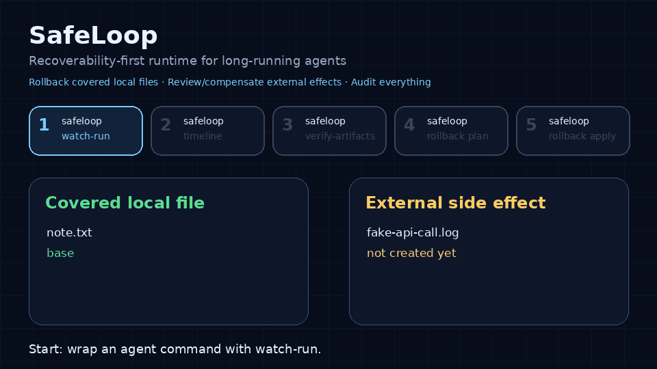

# SafeLoop

[](https://github.com/clawdia-saka/safeloop/actions/workflows/ci.yml)
[](pyproject.toml)
[](LICENSE)

SafeLoop is the local flight recorder and recovery layer for long-running AI agents.

It records local file side effects, checkpoints repo changes, verifies tamper-evident artifacts, supports exact local undo for covered file changes, and marks external side effects as **not tracked** in this release instead of pretending they are blindly reversible.

In short: **roll back covered local files, compensate or manually review external effects, and audit everything.** See [`docs/recoverability-first.md`](docs/recoverability-first.md) for the product boundary and the [threat model](docs/threat-model.md) for audit boundaries.

Current source version: **SafeLoop 0.2.0**. The release workflow publishes GitHub releases and PyPI packages from version tags; until `v0.2.0` is tagged and published, install from this repository.



## Problem

Agents can run for minutes or hours and leave operators asking:

- what command actually ran?
- what files changed, and when?
- are the artifacts intact or tampered with?
- can a checkpoint be locally undone?
- did anything external happen that needs manual compensation?

SafeLoop 0.2.0 hardens the local watchdog, delta-audit packet, and control-plane evidence workflow for those questions.

## Install

SafeLoop requires Python 3.11 or newer.

Install it with `pipx`:

```bash
pipx install safeloop
safeloop --help
```

Or install it into a virtual environment:

```bash
python3 -m venv .venv
. .venv/bin/activate
python -m pip install safeloop
safeloop --version
```

Or install from the repository:

```bash
pipx install git+https://github.com/clawdia-saka/safeloop.git
```

If you need the exact 0.2.0 release source, install from Git:

```bash
pipx install git+https://github.com/clawdia-saka/safeloop.git@v0.2.0
```

Git tag install into a local virtual environment:

```bash
python3 -m venv .venv && . .venv/bin/activate && python -m pip install 'safeloop @ git+https://github.com/clawdia-saka/safeloop.git@v0.2.0'
```

## Quickstart

Check the local install and initialize Codex-oriented SafeLoop files for a repo:

```bash
safeloop doctor
safeloop init --agent codex
```

Run a strict live health smoke before relying on demo packets in automation:

```bash
safeloop doctor --strict
safeloop health --json
```

The strict path creates a temporary local demo workspace, verifies the generated run with `verify-artifacts`, verifies the operator-packet manifest with `operator-packet-verify`, and runs the public-readiness gate when invoked from a source checkout.

Run the one-command local packet demo:

```bash
safeloop demo
```

It creates a temporary local repo, records a SafeLoop run, verifies artifacts, rolls back the covered local file, and writes `operator-packet-v2.md` plus `operator-packet-manifest.json`.

Minimal end-to-end local rollback smoke test:

```bash
rm -rf /tmp/safeloop-demo-repo /tmp/safeloop-demo-runs
mkdir -p /tmp/safeloop-demo-repo
cd /tmp/safeloop-demo-repo
git init -q
git config user.email demo@example.test
git config user.name demo
echo base > note.txt
git add note.txt && git commit -q -m init

safeloop watch-run --task-id demo --repo "$PWD" --run-root /tmp/safeloop-demo-runs -- \
  python -c "from pathlib import Path; Path('note.txt').write_text('changed by safeloop\\n')"

RUN_DIR="$(find /tmp/safeloop-demo-runs -maxdepth 1 -type d -name 'run-*' | head -1)"
RUN_ID="$(basename "$RUN_DIR")"
safeloop review "$RUN_DIR"
safeloop explain "$RUN_DIR"
safeloop rollback plan "$RUN_DIR" "$RUN_ID" --files note.txt
safeloop rollback apply "$RUN_DIR" "$RUN_ID" --files note.txt
cat note.txt  # base
```

Actions outside the local repo are manual-review/compensation only; SafeLoop never claims exact rollback for GitHub, messaging, email, webhook, or other systems beyond the repo. External side effects are manual-review/compensation only.

`safeloop explain RUN_DIR` is the operator-language view:

- **Rollback:** restore covered local repo files from verified artifacts.
- **Compensation:** record a cleanup or correction plan for actions outside the local repo; this remains `exact_rollback: false`.
- **Manual handoff:** route evidence to an operator when SafeLoop cannot safely verify or complete recovery automatically.
- **Action groups:** bundle related files, hunks, checkpoints, and optional action IDs so a person can review one unit of work.

## Demo commands

The shortest public demo path is:

```bash
safeloop demo
```

For CI or artifact upload, pin the output directory:

```bash
safeloop demo --output-dir .safeloop/ci-demo --json
```

The lower-level public demo path is intentionally five commands:

```bash
safeloop watch-run
safeloop timeline
safeloop verify-artifacts
safeloop rollback plan
safeloop rollback apply
```

Install for local development from a checkout:

```bash
python -m pip install -e .
```

Run an agent command under the watchdog with the current 0.2.0 flow:

```bash
safeloop watch-run \
  --task-id demo \
  --repo /path/to/repo \
  -- python agent.py
```

The command prints the run directory, normally under `~/.safeloop/runs/<run-id>/` unless `--run-root` is provided.

Inspect the timeline, verify the tamper-evident artifact packet, then create an operator-readable rollback plan:

```bash
safeloop timeline RUN_DIR
safeloop timeline RUN_DIR --json
safeloop timeline RUN_DIR --checkpoint cp-0001
safeloop verify-artifacts RUN_DIR
safeloop rollback plan RUN_DIR RUN_ID cp-0001
```

Apply covered local-file rollback only after reviewing `rollback-plan.json`:

```bash
safeloop rollback apply RUN_DIR RUN_ID cp-0001
```

Compatibility aliases remain available for older scripts:

- `safeloop watch --loop ...` is an alias-compatible form of `safeloop watch-run ...`.
- `safeloop undo RUN_DIR RUN_ID cp-0001 --dry-run|--apply` remains available for the older dry-run/apply UX.

Or run the checked-in demo script for the release packet flow (`watch-run` → `timeline` → `verify-artifacts` → `rollback plan/apply`):

```bash
bash examples/watchdog_demo.sh
```

For the external side-effect boundary, run:

```bash
bash examples/recoverability_external_effect_demo.sh
```

That demo rolls back a covered local file while leaving fake external API evidence marked `external_review_required`. A static one-page visual is available at [`examples/recoverability_demo.html`](examples/recoverability_demo.html).

For the full public-packet demo, run:

```bash
bash examples/full_demo.sh
```

That script ties the current release flow together in one local workspace: `watch-run` captures local change evidence, `timeline` and `verify-artifacts` build the audit trail, `review` and `rollback plan` produce the operator packet, `rollback apply` restores the covered repo file, and `scripts/public_readiness.py --check` verifies the packet language. The simulated external ticket remains manual-review/compensation territory with `exact_rollback=false`; SafeLoop does not claim rollback for anything outside the demo repo.

For concrete compensation examples and adapter contract shapes for actions outside the local repo, see [`docs/compensation.md`](docs/compensation.md), [`docs/compensation-adapter-contracts.md`](docs/compensation-adapter-contracts.md), and run the local-only fixtures:

```bash
bash examples/compensation_github_issue_demo.sh
bash examples/compensation_message_demo.sh
```

They show that covered local rollback and compensation for actions outside the local repo are separate: the compensation plan records a concrete cleanup/correction action, keeps `exact_rollback: false`, and preserves manual review when GitHub, messaging, email, or webhook state must be verified.

For realistic local-only agent run examples, see [`docs/real-world-agent-runs.md`](docs/real-world-agent-runs.md):

```bash
python examples/coding_agent_run.py --output-dir /tmp/safeloop-real-world/coding
python examples/research_intel_run.py --output-dir /tmp/safeloop-real-world/research
python examples/browser_api_action_run.py --output-dir /tmp/safeloop-real-world/outside-action
```

These examples cover a coding run with test evidence and a rollback plan, a research/intel brief with a stale/low-confidence marker, and a browser/API-like outside action that remains blocked for manual review with `exact_rollback: false`.

For a local-only retrieved-context integration pattern, see [`docs/gbrain-integration-demo.md`](docs/gbrain-integration-demo.md) and run:

```bash
bash examples/gbrain_context_demo.sh
```

That demo uses a mock Gbrain fixture as evidence input only: Gbrain is not the scheduler or control plane, and SafeLoop owns action evidence, rollback planning, and manual review artifacts.

## What it does today

SafeLoop 0.2.0 writes local watchdog and review-aid artifacts such as:

```text
RUN_DIR/
  run.json
  timeline.jsonl
  command.stdout.txt
  command.stderr.txt
  process-result.json
  side-effects.jsonl
  rollback-plan.json
  checkpoints/
    cp-0001/
      checkpoint.json
      manifest.json
      diff.patch
      restore-manifest.json
      summary.md
      undo-preflight.json
      undo-result.json
  verification/
    verify-artifacts-result.json
```

Implemented surfaces:

- `watch --loop` (`watch-run` compatibility alias): executes a command in a repo, captures stdout/stderr, records process result, creates run-local monotonic checkpoints for changed repo state, and binds artifacts into both checkpoint metadata and the timeline hash chain.
- Artifact contract: `run.json`, `timeline.jsonl`, checkpoint metadata, `restore-manifest.json` with `schema_version: restore-manifest.v2`, complete command capture files, and an always-present `side-effects.jsonl` placeholder.
- Checkpoint parent binding: each checkpoint records parent, sequence, allocation mode, previous state digest, current state digest, and artifact digests.
- `verify-artifacts`: checks timeline hash chain, bound artifact digests, checkpoint parent chain, process-result digest, command capture completeness, invalid partial finalization, and run final hash; writes `verification/verify-artifacts-result.json`.
- `timeline`: prints run status, command metadata, checkpoint table, undo status, side-effect status, and latest hash.
- `rollback plan` / `rollback apply`: baseline operator UX for covered local file changes. `rollback plan` writes deterministic `rollback-plan.json` (`schema_version: rollback-plan.v1`) and `rollback apply` writes checkpoint-local `rollback-result.json` (`schema_version: rollback-result.v1`) with post-apply `verify-artifacts` status. External side effects are classified for manual review/compensation, never exact rollback.
- `undo`: compatibility alias for the older dry-run/apply UX and artifact paths (`undo-preflight.json`, `rollback-plan.json`, and `undo-result.json`).
- Existing runtime boundary demos, including repeated resume, remain documented as local lifecycle examples alongside the watchdog release.
- Framework integrations (LangGraph, CrewAI, AutoGen, browser agents, hosted adapters) are future surfaces; the current public path is the local CLI flow above.

## Compensation is not rollback

SafeLoop separates exact local undo from external compensation.

| Term | Means | Does not mean |
| --- | --- | --- |
| Local rollback | SafeLoop applies a reviewed rollback plan for covered local file changes. | External systems, hidden state, or every possible side effect were reset. |
| Compensation | SafeLoop ran a configured cleanup hook after execution began. | Exact rollback, time travel, or an “as-if-never-happened” state. |
| `compensation_failed` | SafeLoop tried cleanup and the hook failed. | The original side effect was safely undone or can be ignored. |

A `compensated` run means the configured compensation hook completed; it does not mean exact rollback or an “as-if-never-happened” state. A `compensation_failed` run means cleanup is incomplete or uncertain and needs operator review. See [`docs/faq.md`](docs/faq.md), [`docs/specs/state-machine-and-journal-schema.md`](docs/specs/state-machine-and-journal-schema.md), and [`docs/case-studies/boundary-scenarios.md`](docs/case-studies/boundary-scenarios.md) for the boundary examples.

## What it does not claim

SafeLoop is intentionally narrow in this release:

- not tamper-proof; artifacts are **tamper-evident local artifacts**
- not a hosted control plane yet
- external actions are not blindly reversible
- gitignored files are out of scope unless configured
- no hosted HTTP dashboard v2 or SaaS control plane
- no Slack/GitHub/Vercel external adapter authority
- no remote transparency log or full rollback-to semantics yet

## Development

Canonical runtime/API contracts:

- State machine and journal schema: `docs/specs/state-machine-and-journal-schema.md`

Run tests:

```bash
pytest -q
```

Build and locally smoke-test a distribution without publishing:

```bash
python -m build
python3 -m venv /tmp/safeloop-wheel-smoke
/tmp/safeloop-wheel-smoke/bin/python -m pip install dist/safeloop-0.2.0-py3-none-any.whl
/tmp/safeloop-wheel-smoke/bin/safeloop --help
/tmp/safeloop-wheel-smoke/bin/safeloop --version
```

For the public MVP readiness boundary, see [`docs/public-mvp-readiness.md`](docs/public-mvp-readiness.md). For maintainer release, tag, and PyPI steps, see [`docs/release.md`](docs/release.md).

## Rollback public readiness skeleton

The public readiness skeleton for SafeLoop 0.2.0 demonstrates the local rollback workflow end to end:
watch a long-running local task, review and explain rollback groups, plan/apply rollback to start,
plan/apply selected files, plan/apply selected hunks, and run `policy-check`. The scripted demo is
`examples/rollback_selective_demo.sh`.

Boundary language for public docs: exact rollback is only claimed for covered local file changes.
External side effects require compensation or manual review and are not exact rollback. Local artifacts
are tamper-evident review aids, not tamper-proof guarantees. SafeLoop does not claim a remote
transparency log unless one is explicitly implemented and configured.

## Historical references

These documents describe earlier release boundaries and remain useful for context, but SafeLoop 0.2.0 is the current source version described above:

- [`docs/safeloop-0.0.3-agent-watchdog-rc.md`](docs/safeloop-0.0.3-agent-watchdog-rc.md)
- [`docs/release-notes-0.0.3.md`](docs/release-notes-0.0.3.md)
- [`docs/control-plane.md`](docs/control-plane.md)
- [`docs/approval-lifecycle.md`](docs/approval-lifecycle.md)
- [`docs/control-plane-threat-model.md`](docs/control-plane-threat-model.md)
- [`docs/release-notes-0.1.0.md`](docs/release-notes-0.1.0.md)
- [`docs/release-notes-0.2.0.md`](docs/release-notes-0.2.0.md)
- [`examples/control-plane-local-demo/`](examples/control-plane-local-demo/)
